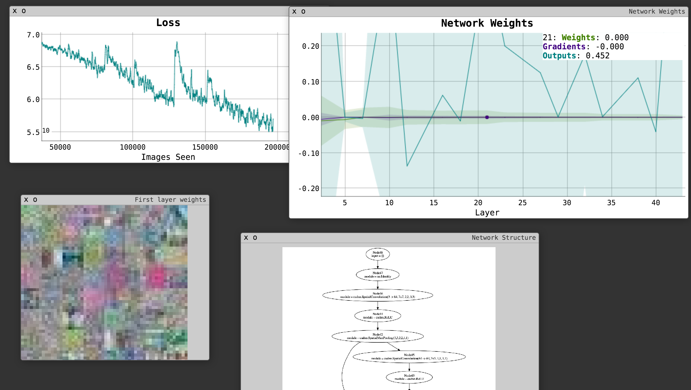

Deep Residual Learning for Image Recognition
============================================

This is a Torch implementation of ["Deep Residual Learning for Image Recognition",Kaiming He, Xiangyu Zhang, Shaoqing Ren, Jian Sun](http://arxiv.org/abs/1512.03385) the winners of the 2015 ILSVRC and COCO challenges.

How to use
----------

- Install Torch, CUDNN, and required torch libraries (at least `fs`,
  `display`, `image`, `cudnn`, `nngraph`, ...)
- Download Imagenet to a folder.
- Run
    th train-imagenet.lua --dataTrainRoot /mnt/imagenet/train --dataValRoot /mnt/imagenet/val
  Images are assumed to have the path `/mnt/imagenet/train/n1234/photo.JPEG`, where `n1234` is the synset ID.
- If you want to monitor progress, run `th -ldisplay.start` in a
  separate shell and visit http://localhost:8000. A log of the
  training loss is reported, as well as the network's instantaneous
  weights, gradients, and activations.

Accuracy
--------

TODO

Notes and shortcomings
----------------------

- This is only a classification task for now. No semantic segmentation
  yet.

- I haven't tested this network yet. It appears to begin converging,
  but not a whole lot.

- The size of the network is so big that I can only fit a small
  version in memory. (Focusing on correctness rather than efficiency
  for now...)
